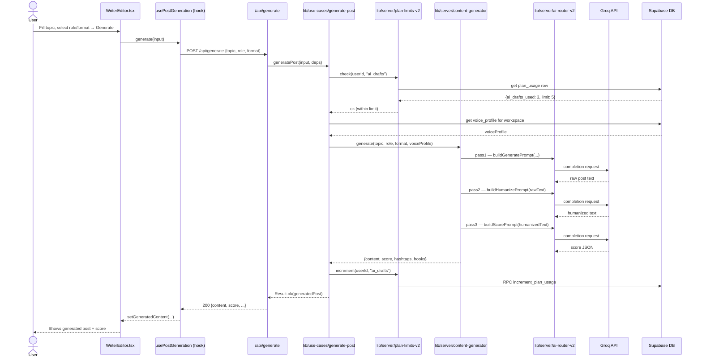
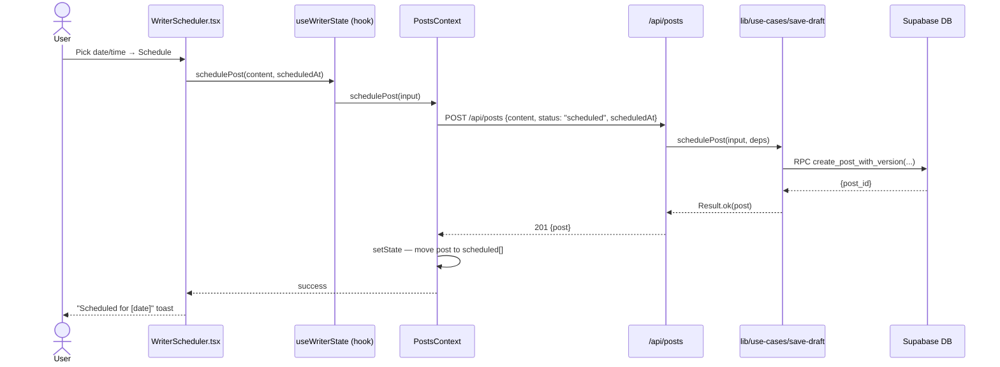
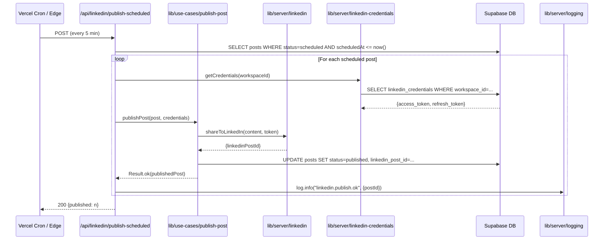
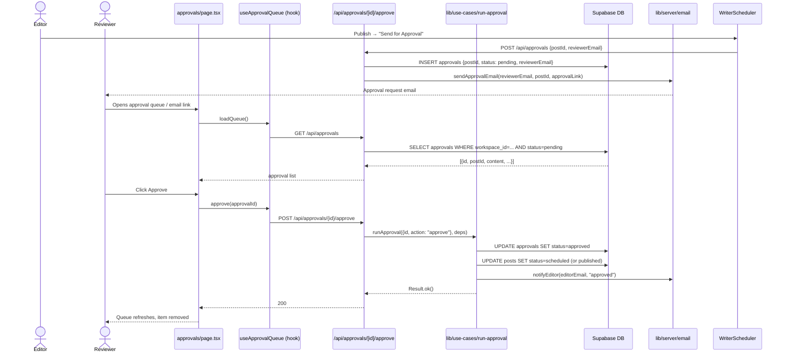

# Phase 2 — Target Architecture

> Stack-specific adaptation of Clean Architecture / Hexagonal Architecture for **Next.js 16 App Router + React 19 + TypeScript**.

---

## 1. Layer Model

```
┌────────────────────────────────────────────────────────────────┐
│  PRESENTATION                                                  │
│  app/(app)/*.tsx  ·  components/  ·  app/page.tsx             │
│  React Server Components  ·  Client Components (use client)   │
│  Knows: UI state only. Calls Application layer via hooks.      │
├────────────────────────────────────────────────────────────────┤
│  APPLICATION                                                   │
│  lib/use-cases/*.ts  ·  lib/hooks/*.ts  ·  app/api/**/*.ts    │
│  Pure TypeScript. No framework imports. No React.              │
│  Orchestrates domain + infrastructure. Returns Result<T,E>.    │
├────────────────────────────────────────────────────────────────┤
│  DOMAIN                                                        │
│  types/domain.ts  ·  types/writer.ts  ·  types/admin.ts       │
│  lib/pricing.ts  ·  lib/entitlements.ts  ·  lib/validation.ts │
│  lib/constants.ts                                              │
│  ZERO external imports. Pure business rules + types.           │
├────────────────────────────────────────────────────────────────┤
│  INFRASTRUCTURE                                                │
│  lib/server/supabase-rest.ts  ·  lib/server/ai-router-v2.ts  │
│  lib/server/redis.ts  ·  lib/server/email.ts                  │
│  lib/server/linkedin.ts  ·  lib/server/payments.ts            │
│  Adapts external systems to domain contracts (interfaces).     │
└────────────────────────────────────────────────────────────────┘

Cross-cutting: lib/server/auth.ts · lib/server/logging.ts
               lib/errors.ts · lib/server/env.ts
```

**The Dependency Rule:** arrows only point inward.
`PRESENTATION → APPLICATION → DOMAIN ← INFRASTRUCTURE`

---

## 2. Screaming Folder Structure

The folder tree below is the **exact target state**. Every folder name is a domain concept, not a framework concept.

```
byqalam-website/
├── types/
│   ├── domain.ts          ← Post, VoiceProfile, Team, ClientWorkspace (EXISTS — expand)
│   ├── writer.ts          ← WriterRole, PostFormat, HookStyle, ScoreBreakdown, DraftVersion (NEW)
│   ├── admin.ts           ← AdminUser, AdminOverride, AuditLogEntry (NEW)
│   └── next-auth.d.ts     ← session augmentation (EXISTS)
│
├── lib/
│   ├── pricing.ts         ← Plan definitions (EXISTS — keep)
│   ├── entitlements.ts    ← PLAN_LIMITS, canAccessPlan (EXISTS — keep)
│   ├── validation.ts      ← isValidLinkedInUrl, isValidEmail, etc. (NEW)
│   ├── constants.ts       ← ROLES, FORMATS, HOOK_STYLES, INDUSTRIES, NICHES (NEW)
│   ├── errors.ts          ← QalamError, Result<T,E> type, mapError (NEW)
│   │
│   ├── use-cases/         ← Application layer: pure TS, no React, no Next.js
│   │   ├── generate-post.ts        ← GeneratePostInput → Result<GeneratedPost, QalamError>
│   │   ├── score-post.ts           ← ScorePostInput → Result<ScoreBreakdown, QalamError>
│   │   ├── save-draft.ts           ← SaveDraftInput → Result<Post, QalamError>
│   │   ├── schedule-post.ts        ← SchedulePostInput → Result<Post, QalamError>
│   │   ├── publish-post.ts         ← PublishPostInput → Result<Post, QalamError>
│   │   ├── train-voice.ts          ← TrainVoiceInput → Result<VoiceProfile, QalamError>
│   │   ├── run-approval.ts         ← ApprovalInput → Result<ApprovalRequest, QalamError>
│   │   ├── research-competitor.ts  ← CompetitorInput → Result<CompetitorReport, QalamError>
│   │   └── manage-admin.ts         ← AdminAction → Result<void, QalamError>
│   │
│   ├── hooks/             ← React custom hooks (thin wrappers over use-cases)
│   │   ├── useWriterState.ts       ← draft, role, format, versions, mutations
│   │   ├── usePostGeneration.ts    ← generate, score, retry
│   │   ├── useProfileForm.ts       ← profile fields, submit, error states
│   │   ├── useBillingInfo.ts       ← plan, usage, upgrade flow
│   │   ├── useCalendarLogic.ts     ← calendar grid, drag-drop, reschedule
│   │   ├── useDashboardMetrics.ts  ← stats fetching + aggregation
│   │   ├── useAdminUsers.ts        ← user search, overrides, audit
│   │   ├── useApprovalQueue.ts     ← queue, approve/reject mutations
│   │   └── useAutosave.ts          ← (EXISTS — keep)
│   │
│   ├── api/
│   │   └── client.ts      ← fetch wrapper (EXISTS — keep)
│   │
│   ├── server/            ← Infrastructure adapters (server-only)
│   │   ├── auth.ts                ← requireAuthApi, withAuth (EXISTS — keep)
│   │   ├── workspace.ts           ← resolveWorkspaceId (EXISTS — keep)
│   │   ├── supabase-rest.ts       ← REST wrapper (EXISTS — evolve to typed)
│   │   ├── ai-router-v2.ts        ← LLM routing (EXISTS — keep)
│   │   ├── content-generator.ts   ← 3-pass pipeline (EXISTS — keep)
│   │   ├── plan-limits-v2.ts      ← quota tracking (EXISTS — keep)
│   │   ├── rate-limit.ts          ← Upstash rate limiting (EXISTS — keep)
│   │   ├── queue.ts               ← Job queue (EXISTS — keep)
│   │   ├── queue-processor.ts     ← Job handler (EXISTS — keep)
│   │   ├── circuit-breaker.ts     ← Circuit breaker (EXISTS — keep)
│   │   ├── linkedin.ts            ← LinkedIn API (EXISTS — keep)
│   │   ├── linkedin-credentials.ts ← Token mgmt (EXISTS — keep)
│   │   ├── payments.ts            ← Webhook verification (EXISTS — keep)
│   │   ├── email.ts               ← Transactional email (EXISTS — keep)
│   │   ├── competitors.ts         ← Research API (EXISTS — keep)
│   │   ├── overrides.ts           ← Admin overrides (EXISTS — keep)
│   │   ├── env.ts                 ← Env validation (EXISTS — keep)
│   │   ├── logging.ts             ← Structured logger + request IDs (NEW)
│   │   └── roles.ts               ← requireRole (EXISTS — keep)
│   │
│   ├── prompts/           ← Split monolith into per-role files
│   │   ├── index.ts                ← Re-exports all builders
│   │   ├── builders/
│   │   │   ├── generate.ts         ← buildGeneratePrompt
│   │   │   ├── humanize.ts         ← buildHumanizePrompt
│   │   │   ├── score.ts            ← buildScorePrompt
│   │   │   ├── rewrite.ts          ← buildRewritePrompt
│   │   │   └── hooks.ts            ← buildHookVariantsPrompt
│   │   └── roles/
│   │       ├── ceo.ts, hr.ts, marketing.ts, sales.ts ...  ← 14 role files
│   │       └── index.ts            ← ROLE_PROFILES map
│   │
│   ├── content-intelligence.ts    ← (EXISTS — keep)
│   ├── carousel-design.ts         ← (EXISTS — keep)
│   ├── voice-analyzer.ts          ← (EXISTS — keep)
│   ├── content-profiles.ts        ← (EXISTS — keep)
│   ├── content-guard.ts           ← (EXISTS — keep)
│   ├── seo.ts                     ← (EXISTS — keep)
│   ├── site-content.ts            ← (EXISTS — keep)
│   ├── seo-landing-pages.ts       ← (EXISTS — keep)
│   └── marketing-content.ts       ← (EXISTS — expand with NICHES, FEATURES)
│
├── app/
│   ├── layout.tsx                 ← (EXISTS — minimal changes)
│   ├── page.tsx                   ← (EXISTS — extract constants to lib/marketing-content)
│   │
│   ├── (app)/
│   │   ├── layout.tsx             ← (EXISTS — keep)
│   │   ├── writer/
│   │   │   ├── page.tsx           ← THIN: composes sub-components only (~100 lines)
│   │   │   ├── WriterEditor.tsx   ← Input form, role/format selector
│   │   │   ├── WriterHooks.tsx    ← Hook generation panel
│   │   │   ├── WriterScoring.tsx  ← Score display + retry
│   │   │   ├── WriterVersions.tsx ← Draft version history
│   │   │   └── WriterScheduler.tsx ← Date picker + publish action
│   │   ├── dashboard/
│   │   │   ├── page.tsx           ← Server component wrapper
│   │   │   └── DashboardClient.tsx ← Thin: uses useDashboardMetrics hook
│   │   ├── settings/
│   │   │   ├── page.tsx           ← Thin: composes sub-panels
│   │   │   ├── ProfilePanel.tsx   ← Uses useProfileForm
│   │   │   ├── BillingPanel.tsx   ← Uses useBillingInfo
│   │   │   └── AccountPanel.tsx   ← Account deletion, password change
│   │   ├── calendar/
│   │   │   └── page.tsx           ← Uses useCalendarLogic hook (~200 lines)
│   │   ├── approvals/
│   │   │   └── page.tsx           ← Uses useApprovalQueue hook
│   │   └── ... (rest unchanged structurally)
│   │
│   └── api/               ← Thin route handlers: parse → call use-case → serialize
│       └── ... (81 routes, each ≤ 80 lines)
│
└── components/
    ├── providers/
    │   ├── WorkspaceProvider.tsx  ← SPLIT into sub-contexts (see §4)
    │   ├── PostsContext.tsx        ← Posts state slice (NEW)
    │   ├── BillingContext.tsx      ← Billing state slice (NEW)
    │   └── ProfileContext.tsx      ← Profile state slice (NEW)
    └── ... (all other components — mostly keep)
```

---

## 3. Layer Contracts (Interfaces)

### 3.1 Domain Types (no external imports)

```typescript
// types/domain.ts — extended
export type PostStatus = "draft" | "scheduled" | "pending_approval" | "published" | "rejected"
export type UserPlan = "free" | "solo" | "pro" | "agency"

export interface Post {
  id: string
  workspaceId: string
  userId: string
  title: string
  content: string
  status: PostStatus
  scheduledAt?: Date
  publishedAt?: Date
  linkedinPostId?: string
  metadata?: Record<string, unknown>
  createdAt: Date
  updatedAt: Date
}

// types/writer.ts — NEW
export type WriterRole = "CEO" | "HR" | "Marketing" | "Sales" | "Founder"
  | "Designer" | "Engineer" | "Consultant" | "Coach" | "Recruiter"
  | "Investor" | "Author" | "Educator" | "Finance"

export type PostFormat = "Short" | "Medium" | "Long" | "Carousel"

export type HookStyle = "SHARP" | "AUTHORITY" | "STORY" | "DATA"

export interface ScoreBreakdown {
  overall: number
  hooks: number
  cta: number
  readability: number
  engagement: number
  tips: string[]
}

export interface DraftVersion {
  content: string
  timestamp: string
  role: WriterRole
}
```

### 3.2 Application Layer Contracts (use-case inputs/outputs)

```typescript
// lib/use-cases/generate-post.ts
import type { WriterRole, PostFormat, ScoreBreakdown } from "@/types/writer"
import type { Result } from "@/lib/errors"

export interface GeneratePostInput {
  topic: string
  role: WriterRole
  format: PostFormat
  voiceProfileId?: string
  workspaceId: string
  userId: string
}

export interface GeneratedPost {
  content: string
  score: ScoreBreakdown
  hashtags: string[]
  hooks: string[]
}

export async function generatePost(
  input: GeneratePostInput,
  deps: { contentGenerator: ContentGeneratorPort; planLimits: PlanLimitsPort }
): Promise<Result<GeneratedPost, QalamError>>
```

### 3.3 Infrastructure Ports (interfaces — defined in domain/application, implemented in infrastructure)

```typescript
// lib/use-cases/ports.ts
export interface ContentGeneratorPort {
  generate(params: GenerateParams): Promise<GeneratedPost>
}

export interface PostRepositoryPort {
  findByWorkspace(workspaceId: string, opts?: FindPostsOpts): Promise<Post[]>
  create(post: CreatePostInput): Promise<Post>
  update(id: string, patch: Partial<Post>): Promise<Post>
  delete(id: string): Promise<void>
}

export interface PlanLimitsPort {
  check(userId: string, feature: UsageStat): Promise<boolean>
  increment(userId: string, feature: UsageStat): Promise<void>
}

export interface VoiceProfilePort {
  getByWorkspace(workspaceId: string): Promise<VoiceProfile | null>
  save(workspaceId: string, profile: VoiceProfileInput): Promise<VoiceProfile>
}
```

### 3.4 Error Contract

```typescript
// lib/errors.ts
export type QalamErrorCode =
  | "UNAUTHORIZED"
  | "FORBIDDEN"
  | "NOT_FOUND"
  | "PLAN_LIMIT_EXCEEDED"
  | "VALIDATION_ERROR"
  | "AI_UNAVAILABLE"
  | "LINKEDIN_ERROR"
  | "PAYMENT_ERROR"
  | "INTERNAL_ERROR"

export interface QalamError {
  code: QalamErrorCode
  message: string       // safe for logging
  userMessage?: string  // safe for UI display
  cause?: unknown
}

export type Result<T, E = QalamError> =
  | { ok: true; data: T }
  | { ok: false; error: E }

export function ok<T>(data: T): Result<T> { return { ok: true, data } }
export function err(error: QalamError): Result<never> { return { ok: false, error } }

// Error → HTTP status mapping (keep in API layer only)
export function errorToStatus(code: QalamErrorCode): number {
  const map: Record<QalamErrorCode, number> = {
    UNAUTHORIZED: 401, FORBIDDEN: 403, NOT_FOUND: 404,
    PLAN_LIMIT_EXCEEDED: 429, VALIDATION_ERROR: 400,
    AI_UNAVAILABLE: 503, LINKEDIN_ERROR: 502,
    PAYMENT_ERROR: 400, INTERNAL_ERROR: 500,
  }
  return map[code]
}
```

---

## 4. WorkspaceProvider Split Strategy

The monolithic `WorkspaceProvider` (491 lines, 15 methods) becomes three focused contexts:

```
ProtectedAppProviders (orchestrator wrapper)
├── PostsContext       ← posts[], drafts[], scheduled[], published[]
│   └── mutations: saveDraft, schedulePost, publishPost, deleteDraft
├── ProfileContext     ← workspaceProfile, billing, saveProfile
│   └── mutations: saveProfile, saveVoiceProfile
└── AgencyContext      ← clients[], teamMembers[], addClient, removeClient
    └── (only mounts for Pro/Agency plan users)
```

Each context:
- Has its own file under `components/providers/`
- Manages one domain slice only
- Has its own loading state
- Fetches its own data (no shared mutation function)

```typescript
// components/providers/PostsContext.tsx
export const PostsContext = createContext<PostsContextValue | null>(null)

interface PostsContextValue {
  posts: Post[]
  drafts: Post[]
  scheduled: Post[]
  published: Post[]
  isLoading: boolean
  saveDraft: (input: SaveDraftInput) => Promise<Result<Post>>
  schedulePost: (input: ScheduleInput) => Promise<Result<Post>>
  publishPost: (input: PublishInput) => Promise<Result<Post>>
  deleteDraft: (id: string) => Promise<Result<void>>
}
```

---

## 5. API Route Pattern

Every API route becomes a thin transport layer — **≤ 80 lines**:

```typescript
// app/api/generate/route.ts (target state)
import { requireAuthApi } from "@/lib/server/auth"
import { resolveWorkspaceId } from "@/lib/server/workspace"
import { generatePost, GeneratePostInput } from "@/lib/use-cases/generate-post"
import { errorToStatus } from "@/lib/errors"
import { GenerateSchema } from "@/lib/schemas/generate"
import { log } from "@/lib/server/logging"

export async function POST(req: NextRequest) {
  const reqId = crypto.randomUUID()
  try {
    const auth = await requireAuthApi(req)
    if (!auth.userId) return NextResponse.json({ error: "Unauthorized" }, { status: 401 })

    const workspaceId = await resolveWorkspaceId(req)
    const body = GenerateSchema.parse(await req.json())

    log.info("generate.post.start", { reqId, userId: auth.userId, workspaceId })

    const result = await generatePost({ ...body, workspaceId, userId: auth.userId }, deps)

    if (!result.ok) {
      log.warn("generate.post.fail", { reqId, code: result.error.code })
      return NextResponse.json(
        { error: result.error.userMessage ?? result.error.message },
        { status: errorToStatus(result.error.code) }
      )
    }

    log.info("generate.post.done", { reqId })
    return NextResponse.json(result.data, { status: 200 })
  } catch (e) {
    log.error("generate.post.unhandled", { reqId, error: e })
    return NextResponse.json({ error: "Internal error" }, { status: 500 })
  }
}
```

---

## 6. Data Flow Diagrams Per Use Case

### 6.1 Generate Post



### 6.2 Save & Schedule Post



### 6.3 LinkedIn Publish (Scheduled Job)



### 6.4 Approval Workflow



---

## 7. Where Each Existing File Moves

### Files That SPLIT

| Existing File | Lines | Splits Into |
|---------------|-------|-------------|
| `app/(app)/writer/page.tsx` | 1544 | `writer/page.tsx` (100L) + `WriterEditor.tsx` + `WriterHooks.tsx` + `WriterScoring.tsx` + `WriterVersions.tsx` + `WriterScheduler.tsx` + `lib/hooks/useWriterState.ts` + `lib/hooks/usePostGeneration.ts` |
| `components/providers/WorkspaceProvider.tsx` | 491 | `PostsContext.tsx` + `ProfileContext.tsx` + `AgencyContext.tsx` + `ProtectedAppProviders.tsx` (orchestrator) |
| `lib/prompts/role-aware-system.ts` | 1354 | `lib/prompts/builders/generate.ts` + `humanize.ts` + `score.ts` + `rewrite.ts` + `hooks.ts` + `lib/prompts/roles/{14 files}.ts` |
| `app/(app)/settings/page.tsx` | 773 | `settings/page.tsx` (50L) + `ProfilePanel.tsx` + `BillingPanel.tsx` + `AccountPanel.tsx` + `lib/hooks/useProfileForm.ts` + `lib/hooks/useBillingInfo.ts` |
| `app/(app)/dashboard/DashboardClient.tsx` | 748 | `DashboardClient.tsx` (200L) + `lib/hooks/useDashboardMetrics.ts` |
| `app/(app)/calendar/page.tsx` | 645 | `calendar/page.tsx` (200L) + `lib/hooks/useCalendarLogic.ts` |
| `app/admin/AdminDashboard.tsx` | 618 | `AdminDashboard.tsx` (200L) + `lib/hooks/useAdminUsers.ts` + `types/admin.ts` |
| `app/page.tsx` | 887 | Inline constants → `lib/marketing-content.ts`; `lib/constants.ts` |

### Files That MOVE (rename/relocate)

| Existing Location | Target Location | Reason |
|-------------------|----------------|---------|
| Inline types in `writer/page.tsx` | `types/writer.ts` | Domain types out of UI |
| Inline types in `AdminDashboard.tsx` | `types/admin.ts` | Domain types out of UI |
| `isValidLinkedInUrl` in `settings/page.tsx` | `lib/validation.ts` | Validation → lib |
| NICHES, FEATURES arrays in `app/page.tsx` | `lib/marketing-content.ts` | Content → lib |
| ACCOUNT_ROLES, INDUSTRY_OPTIONS in `settings/page.tsx` | `lib/constants.ts` | Config → lib |
| Generation orchestration in `generate/route.ts` | `lib/use-cases/generate-post.ts` | Business logic → use-case |
| Workflow state changes in `approvals/page.tsx` | `lib/use-cases/run-approval.ts` | Business logic → use-case |

### Files That STAY (no structural changes needed)

```
lib/pricing.ts, lib/entitlements.ts, lib/seo.ts, lib/site-content.ts
lib/server/auth.ts, lib/server/workspace.ts, lib/server/supabase-rest.ts
lib/server/content-generator.ts, lib/server/ai-router-v2.ts
lib/server/plan-limits-v2.ts, lib/server/rate-limit.ts
lib/server/queue.ts, lib/server/circuit-breaker.ts
lib/server/linkedin.ts, lib/server/payments.ts, lib/server/email.ts
All app/api/** route handlers (shape preserved, use-cases extracted)
types/domain.ts (expanded, not replaced)
supabase/migrations/ (untouched)
```

### Files That DIE (content moved elsewhere)

| File | What Replaces It |
|------|-----------------|
| Inline type `Role` in `writer/page.tsx` | `types/writer.ts:WriterRole` |
| Inline type `HookStyle` in `writer/page.tsx` | `types/writer.ts:HookStyle` |
| Inline `const ROLES = [...]` in `writer/page.tsx` | `lib/constants.ts:WRITER_ROLES` |
| Inline `const NICHES = [...]` in `app/page.tsx` | `lib/marketing-content.ts:NICHES` |

---

## 8. Dependency Injection Strategy

Next.js 16 App Router has no DI container. Use **manual constructor injection** in use-cases and **module-level singletons** for infrastructure:

```typescript
// lib/server/deps.ts — singleton deps bag (server-only)
import { createSupabaseServiceClient } from "@/lib/server/supabase-rest"
import { PostRepository } from "@/lib/server/repositories/post-repository"
import { PlanLimitsAdapter } from "@/lib/server/plan-limits-v2"
import { ContentGeneratorAdapter } from "@/lib/server/content-generator"

export const deps = {
  postRepo: new PostRepository(createSupabaseServiceClient()),
  planLimits: new PlanLimitsAdapter(createSupabaseServiceClient()),
  contentGenerator: new ContentGeneratorAdapter(),
}
```

API routes import `deps` and pass to use-cases:
```typescript
import { deps } from "@/lib/server/deps"
const result = await generatePost(input, deps)
```

For tests, inject mocks:
```typescript
const result = await generatePost(input, {
  contentGenerator: mockContentGenerator,
  planLimits: mockPlanLimits,
})
```

---

## 9. Error Propagation Policy

```
INFRASTRUCTURE layer → throws raw Error / provider error
         ↓ caught by →
APPLICATION (use-case) → converts to Result<T, QalamError>
         ↓ returned to →
API ROUTE → converts Result.error to HTTP status + safe user message
         ↓ returned to →
PRESENTATION (hook) → converts HTTP error to UI error state
```

**Rule:** Errors never propagate as raw exceptions across layer boundaries. Use `Result<T, QalamError>` everywhere in the application layer. Only the API route converts errors to HTTP status codes.

---

## 10. Test Pyramid Targets Per Layer

| Layer | Test Type | Tool | Coverage Target |
|-------|-----------|------|----------------|
| Domain (`types/`, `lib/pricing.ts`, `lib/entitlements.ts`, `lib/validation.ts`) | Pure unit | Vitest | 100% (pure functions) |
| Application (`lib/use-cases/*.ts`) | Unit with mocked ports | Vitest | 90%+ |
| Infrastructure (`lib/server/*.ts`) | Integration (real DB in CI) | Vitest + testcontainers or Supabase test env | 70%+ |
| API routes (`app/api/**`) | Integration (supertest or fetch) | Vitest | Key flows only |
| Presentation (React components) | Component tests | Vitest + Testing Library | Critical paths |
| E2E | User flows end-to-end | Playwright | 5 critical journeys |

The key insight: **use-cases can be tested without React, Next.js, or Supabase**. Inject mock ports.
