# Phase 5 — Visual System Map

> C4 model (Context → Container → Component → Code) + critical user journey sequence diagrams + module dependency matrix.

---

## 1. C4 Level 1 — System Context

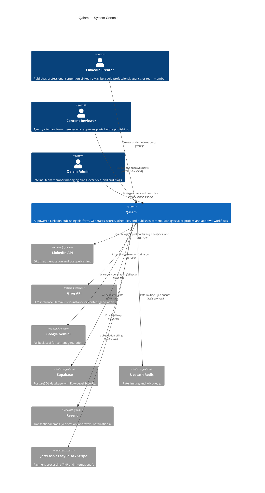

---

## 2. C4 Level 2 — Container

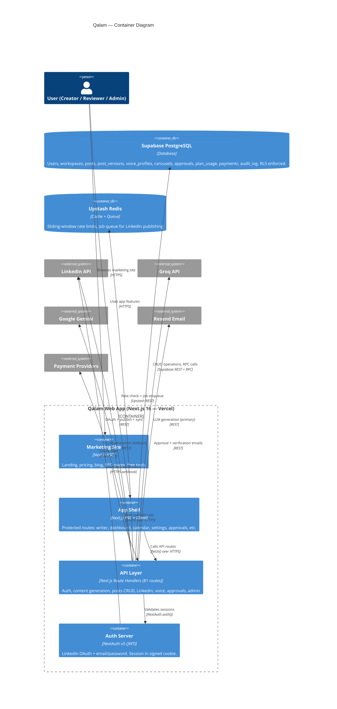

---

## 3. C4 Level 3 — Component (App Shell)

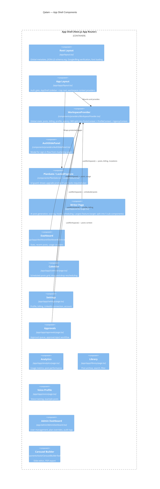

---

## 4. C4 Level 4 — Code (Generate Post Flow)

```mermaid
C4Code
    title Generate Post — Code Level

    Component(writer_editor, "WriterEditor.tsx", "React component", "Form inputs: topic, role, format. Calls usePostGeneration hook.")
    Component(use_gen, "usePostGeneration", "lib/hooks/usePostGeneration.ts", "useState for isGenerating, score, hooks. Calls /api/generate via fetch.")
    Component(api_gen, "POST /api/generate", "app/api/generate/route.ts", "Thin handler: auth → parse → call use-case → serialize")
    Component(uc_gen, "generatePost()", "lib/use-cases/generate-post.ts", "Orchestrates: check limit → fetch voice → generate → score → increment usage. Returns Result<GeneratedPost>.")
    Component(plan_limits, "PlanLimitsAdapter", "lib/server/plan-limits-v2.ts", "Implements PlanLimitsPort. Calls DB RPC get_or_create_plan_usage and increment_plan_usage.")
    Component(content_gen, "ContentGeneratorAdapter", "lib/server/content-generator.ts", "3-pass pipeline: generate → humanize → score. Implements ContentGeneratorPort.")
    Component(ai_router, "AIRouterV2", "lib/server/ai-router-v2.ts", "Routes to Groq (primary) or Gemini (fallback). Circuit breaker. Queue.")
    Component(supa_rest, "supabaseSelect/Insert", "lib/server/supabase-rest.ts", "REST wrapper for Supabase. Returns typed arrays.")
    Component(db_plan, "plan_usage table", "Supabase DB", "Tracks monthly usage per user. RLS: user can only see own row.")
    Component(db_voice, "voice_profiles table", "Supabase DB", "Stores voice profile per workspace.")
    Component(groq_api, "Groq API", "External", "LLM inference endpoint.")

    Rel(writer_editor, use_gen, "generate(params)")
    Rel(use_gen, api_gen, "POST /api/generate")
    Rel(api_gen, uc_gen, "generatePost(input, deps)")
    Rel(uc_gen, plan_limits, "check() + increment()")
    Rel(uc_gen, content_gen, "generate()")
    Rel(plan_limits, supa_rest, "RPC calls")
    Rel(content_gen, ai_router, "complete(prompt, params)")
    Rel(ai_router, groq_api, "POST /openai/v1/chat/completions")
    Rel(supa_rest, db_plan, "REST GET + PATCH")
    Rel(supa_rest, db_voice, "REST GET")
```

---

## 5. Sequence Diagrams — Critical User Journeys

### 5.1 New User Signup via LinkedIn OAuth

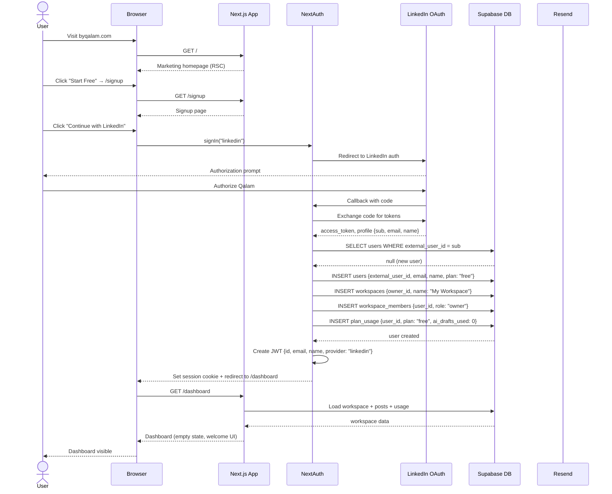

### 5.2 AI Post Generation (Full Happy Path)

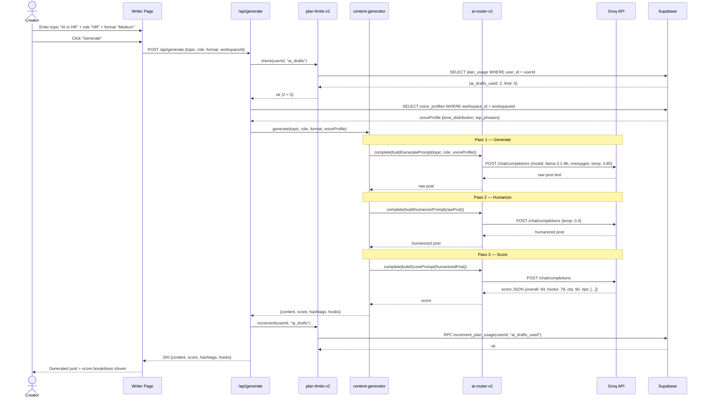

### 5.3 Post Approval Workflow

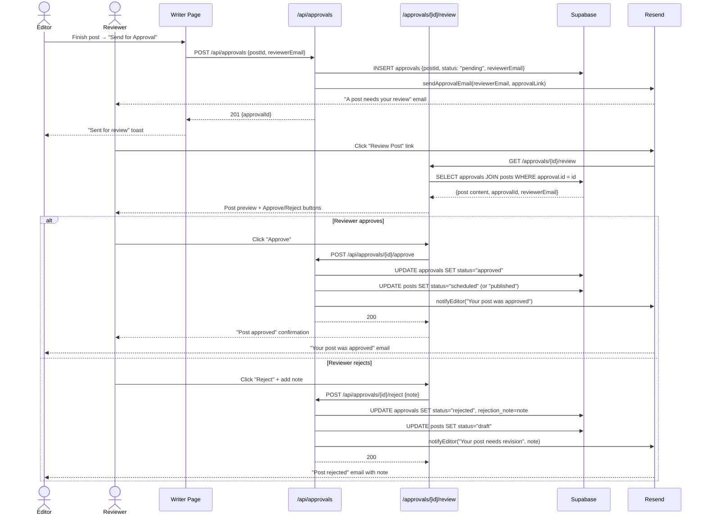

### 5.4 LinkedIn Scheduled Publishing

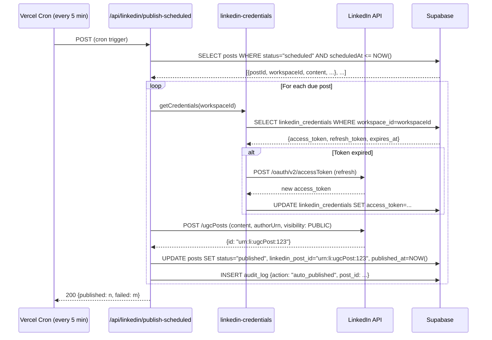

### 5.5 Admin Plan Override

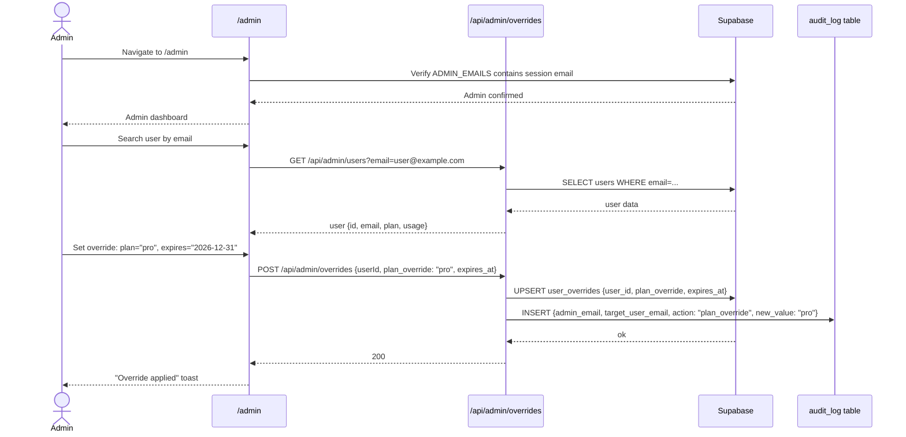

---

## 6. Module Dependency Matrix

> `●` = direct dependency  `○` = transitive dependency  `—` = no dependency

| Module | domain | use-cases | lib/hooks | lib/server | app/api | components | app/(app) |
|--------|:------:|:---------:|:---------:|:----------:|:-------:|:----------:|:---------:|
| **domain** | — | — | — | — | — | — | — |
| **use-cases** | ● | — | — | — | — | — | — |
| **lib/hooks** | ● | ● | — | — | — | — | — |
| **lib/server** | ● | ○ | — | — | — | — | — |
| **app/api** | ● | ● | — | ● | — | — | — |
| **components** | ● | ○ | ● | — | — | — | — |
| **app/(app)** | ○ | ○ | ● | — | — | ● | — |

**Reading:** Rows depend on columns. `●` in `app/api` × `lib/server` means API routes directly depend on server utilities.

**Key constraint:** `components` row has no `●` in `lib/server` — client components never import server code.

---

## 7. Database Schema Map

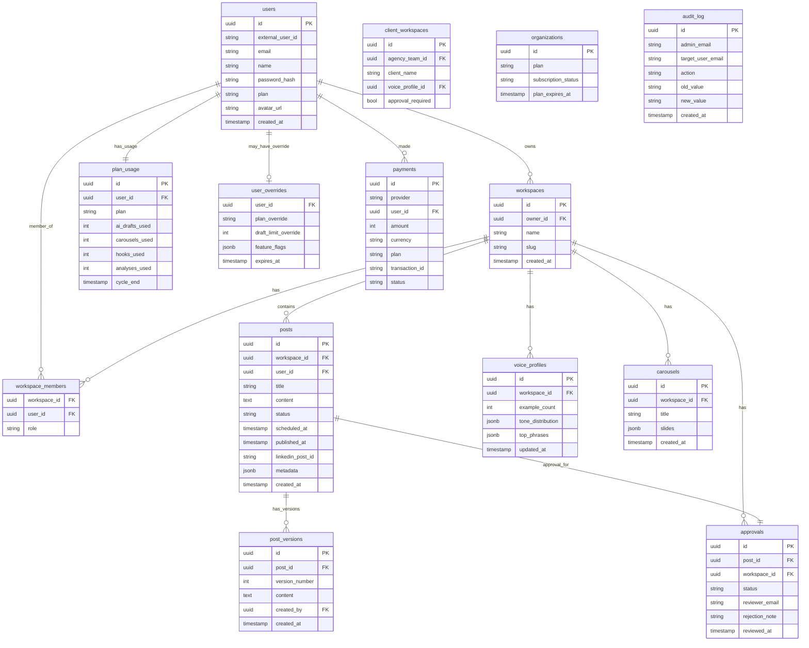

---

## 8. Infrastructure Architecture

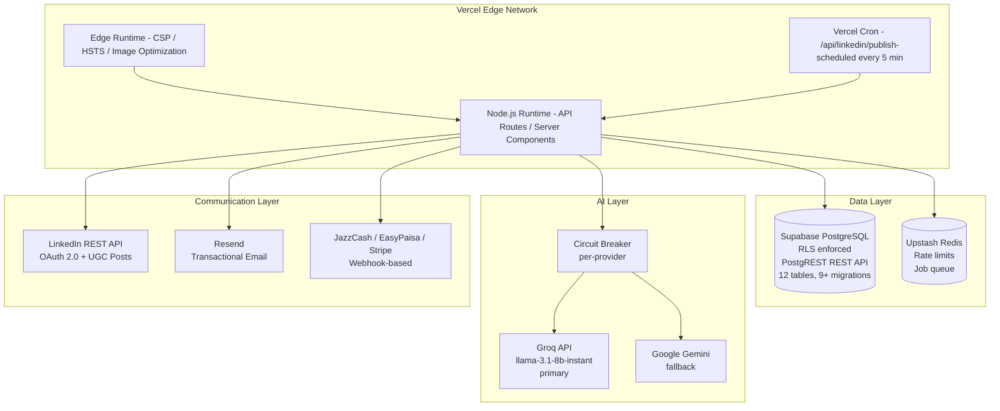

---

## 9. Authentication State Machine

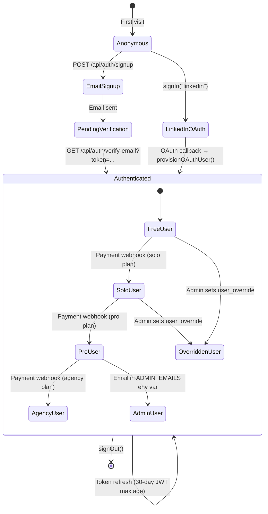

---

## 10. Plan Feature Availability Matrix

```mermaid
graph LR
    subgraph FREE["Free (0 PKR/mo)"]
        F1[5 posts/month]
        F2[1 carousel]
        F3[5 hooks]
        F4[5 analyses]
        F5[Basic voice profile]
    end

    subgraph SOLO["Solo (499 PKR/mo)"]
        S1[30 posts/month]
        S2[3 carousels]
        S3[30 hooks]
        S4[10 analyses]
        S5[LinkedIn publishing]
        S6[Scheduling]
        S7[Post library]
    end

    subgraph PRO["Pro (1490 PKR/mo)"]
        P1[60 posts/month]
        P2[10 carousels]
        P3[60 hooks]
        P4[20 analyses]
        P5[Advanced voice training]
        P6[Analytics dashboard]
        P7[Competitor research]
        P8[Carousel themes + branding]
        P9[Chat strategist]
    end

    subgraph AGENCY["Agency (7490 PKR/mo - coming soon)"]
        A1[300 posts/month]
        A2[50 carousels]
        A3[5 workspaces]
        A4[Team members]
        A5[Client workspaces]
        A6[Approval workflows]
        A7[White-label export]
    end

    FREE --> SOLO
    SOLO --> PRO
    PRO --> AGENCY
```

---

## Self-Check Answers

| Question | Answer |
|----------|--------|
| Can a new hire understand the system in 30 min from `/architecture/`? | **Yes** — C4 maps show scope; audit shows current sins; migration plan shows path |
| Can I delete the UI layer and business logic still runs in tests? | **After migration: Yes** — use-cases in `lib/use-cases/` have zero React deps; test with mocked ports |
| Can I swap Supabase for another DB by changing only the infrastructure layer? | **Yes** — after migration, all DB calls go through `PostRepositoryPort` (interface). Implement a new adapter. |
| Does every file have exactly one reason to change? | **No (current), Yes (target)** — migration plan eliminates the god files |
| Would Uncle Bob, Eric Evans, and Martin Fowler sign off? | **On target architecture: Yes.** On current state: No. |
| Can each migration PR ship without users noticing? | **Yes** — every step is additive or purely internal refactor |
| Is there a feature flag strategy for risky moves? | **Yes** — Step 9 in migration plan documents `NEXT_PUBLIC_USE_SPLIT_CONTEXT` flag |
| Are there any hot files needing extra coordination? | **Yes** — `writer/page.tsx` (1544L), `WorkspaceProvider.tsx` (491L), `generate/route.ts` (246L). These need PR review from two people minimum. |
